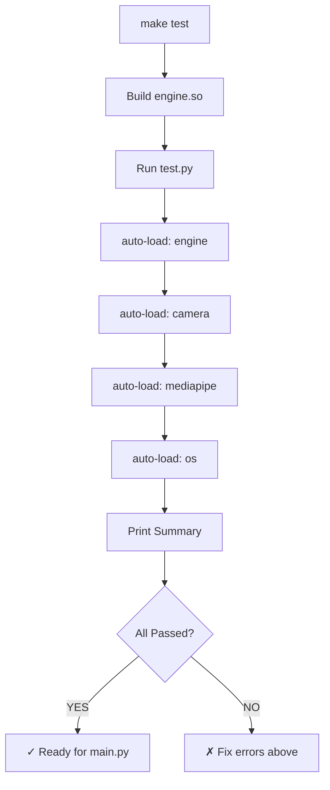

# 🧪 FreeFace Unit Testing Guide

Complete testing documentation for the FreeFace assistive control system.

---

## 📋 Quick Start

### Run All Tests
```bash
make test
```

### Run Specific Test Component
```bash
make test-engine      # C++ engine only
make test-camera      # Webcam detection
make test-mediapipe   # Face mesh processing
make test-gaze        # Live gaze tracking (interactive - 10s)
make test-blink       # Blink detection (interactive - 15s)
make test-voice       # Voice recognition
make test-keyboard    # Virtual keyboard UI
make test-os          # OS mouse/keyboard control
```

### Or Run Tests Directly
```bash
python3 test.py                # all non-interactive tests
python3 test.py engine         # test C++ engine only
python3 test.py camera         # test webcam only
python3 test.py gaze           # test gaze tracking live
python3 test.py blink          # test blink detection live
python3 test.py voice          # test voice recognition
python3 test.py keyboard       # test virtual keyboard
python3 test.py os             # test OS mouse/keyboard control
```

---

## 🔧 Test Components

### 1. **C++ Engine Test** (`test_engine`)
**Purpose:** Verify the compiled C++ engine library loads and processes facial landmarks correctly.

**What it tests:**
- ✓ `engine.so` library exists and loads via Python ctypes
- ✓ Engine can process dummy landmark arrays (478 points)
- ✓ Action processing returns valid action labels
- ✓ Calibration mode initialization
- ✓ Feature toggle (blink detection on/off)
- ✓ Frame counter increments

**Requirements:**
- C++ engine compiled: `make` (builds `engine.so`)

**Expected Output:**
```
✓ PASS  Engine loaded
✓ PASS  processFrame() returned: IDLE
✓ PASS  Calibration mode works
✓ PASS  Feature toggles work
✓ PASS  Frame count: 478
```

---

### 2. **Webcam Test** (`test_camera`)
**Purpose:** Verify webcam is accessible and can capture frames.

**What it tests:**
- ✓ OpenCV can open webcam at index 0
- ✓ Camera can read frames
- ✓ Frame resolution detection

**Requirements:**
- Webcam connected and functional
- OpenCV installed (`pip install opencv-python`)

**Expected Output:**
```
✓ PASS  Webcam opened: 640x480
```

**Troubleshooting:**
- If camera index 0 fails, edit [python/main.py](python/main.py#L25) and change `WEBCAM_IDX = 0` to the correct index
- Check camera permissions: `ls /dev/video*`

---

### 3. **MediaPipe FaceMesh Test** (`test_mediapipe`)
**Purpose:** Verify MediaPipe face mesh extraction works and handles edge cases.

**What it tests:**
- ✓ MediaPipe library imports
- ✓ Face mesh processor initializes
- ✓ Returns `None` when no face detected (blank frame)
- ✓ Annotated frame generation

**Requirements:**
- MediaPipe installed: `pip install mediapipe>=0.10.0`

**Expected Output:**
```
✓ PASS  MediaPipe imported (version: 0.10.5)
✓ PASS  FaceMesh processes blank frame correctly (no face detected)
```

---

### 4. **Live Gaze Tracking Test** (`test_gaze` - Interactive)
**Purpose:** Real-time verification that gaze estimation works correctly.

**What it tests:**
- ✓ Live face mesh extraction from webcam
- ✓ Engine processes facial landmarks
- ✓ Gaze point calculation (normalized 0.0-1.0 coordinates)
- ✓ Crosshair rendering at predicted gaze location
- ✓ Visual feedback on screen

**Duration:** 10 seconds (auto-closes)

**Controls:**
- `Q` = Stop early
- Crosshair should follow your eye gaze

**Expected Output:**
- Window titled "Gaze Test" opens
- Crosshair follows your eyes
- ```
  ✓ PASS  Gaze test complete
  ```

**Troubleshooting:**
- Crosshair not following gaze? → Recalibrate in main app
- Window freezes? → Check camera permissions

---

### 5. **Blink Detection Test** (`test_blink` - Interactive)
**Purpose:** Verify blink detection accuracy and event triggering.

**What it tests:**
- ✓ Live facial landmark extraction
- ✓ Blink event detection algorithm
- ✓ Blink counter increments
- ✓ Engine action classification (LEFT_CLICK, DOUBLE_CLICK)

**Duration:** 15 seconds (auto-closes)

**Controls:**
- Blink slowly and deliberately
- Counter updates in real-time
- `Q` = Stop early

**Expected Output:**
- Window titled "Blink Test | Q=stop"
- Counter increments with each blink
- ```
  ✓ PASS  Detected 5 blink(s)
  ```

**Troubleshooting:**
- No blinks detected?
  - Ensure good lighting
  - Make slow, deliberate blinks
  - Run calibration in main app first

---

### 6. **Voice Recognition Test** (`test_voice`)
**Purpose:** Verify speech recognition captures and transcribes audio.

**What it tests:**
- ✓ Microphone is accessible
- ✓ Audio input captured
- ✓ Google Speech-to-Text API returns transcription
- ✓ Ambient noise adjustment

**Duration:** ~10 seconds

**Requirements:**
- Microphone connected
- Internet connection (uses Google API)
- `pip install SpeechRecognition pyaudio`

**Expected Output:**
```
  → Adjusting for ambient noise...
  → Listening... speak now!
✓ PASS  Heard: "Hello world"
```

**Troubleshooting:**
- "No speech detected (timeout)"?
  - Speak louder and clearer
  - Check microphone volume
- "Could not understand it"?
  - Reduce background noise
  - Speak slower

---

### 7. **Virtual Keyboard Test** (`test_keyboard`)
**Purpose:** Verify on-screen keyboard UI renders and responds.

**What it tests:**
- ✓ VirtualKeyboard class initializes
- ✓ Keyboard window opens
- ✓ Can be shown/hidden

**Duration:** 5 seconds

**Expected Output:**
- On-screen keyboard appears
- After 5s, window auto-closes
- ```
  ✓ PASS  Virtual keyboard opened and closed
  ```

---

### 8. **OS Control Test** (`test_os`)
**Purpose:** Verify system-level mouse and keyboard control works.

**What it tests:**
- ✓ Mouse movement via pynput
- ✓ Mouse coordinates normalized (0.0-1.0)
- ✓ Keyboard input (space key)
- ✓ Screen resolution detection (1920x1080 default)

**Duration:** 2 seconds

**Expected Output:**
- Mouse moves in small circle
- Space key is typed
- ```
  ✓ PASS  Mouse movement works
  ✓ PASS  Keyboard works
  ```

**Troubleshooting:**
- Mouse won't move?
  - Check system permissions
  - May require sudo on Linux: `sudo python3 test.py os`

---

## 📊 Default Test Suite

When you run `make test` or `python3 test.py` with no arguments, these **non-interactive** tests run automatically:

| Test | Type | Notes |
|------|------|-------|
| `engine` | Automated | Requires compiled `engine.so` |
| `camera` | Automated | Requires webcam |
| `mediapipe` | Automated | No interaction needed |
| `os` | Automated | May need permissions |

**Interactive tests** (gaze, blink, voice, keyboard) require manual triggers and are NOT run by default. Run them individually with:
```bash
make test-gaze
make test-blink
make test-voice
make test-keyboard
```

---

## 🔨 Setup & Build

### 1. Install Dependencies
```bash
pip install -r requirements.txt
```

**Required packages:**
- `mediapipe>=0.10.0` — Face mesh extraction
- `opencv-python>=4.8.0` — Camera & image processing
- `SpeechRecognition>=3.10.0` — Voice input
- `pyaudio>=0.2.13` — Audio device interface
- `numpy>=1.24.0` — Array operations
- `pynput>=1.7.6` — OS mouse/keyboard control

### 2. Build C++ Engine
```bash
make
```

Generates: `engine.so` in project root

**Troubleshooting:**
- `g++ not found`? Install: `apt-get install build-essential`
- `error: cannot find -lstdc++`? Install: `apt-get install libstdc++-dev`

### 3. Run Verification
```bash
make test
```

---

## 🎯 Test Execution Flow



---

## 📁 Project Structure for Testing

```
/data/programing/Help Snehal/
├── Makefile                 ← Contains test targets
├── test.py                  ← Test suite (run this)
├── requirements.txt         ← Python dependencies
├── engine.so               ← Compiled C++ engine (generated by make)
├── cpp/
│   ├── include/            ← C++ headers
│   │   ├── LandmarkFrame.h
│   │   ├── Filters.h
│   │   ├── Detectors.h
│   │   └── FreeFaceEngine.h
│   └── src/                ← C++ implementations
│       ├── Detectors.cpp
│       ├── FreeFaceEngine.cpp
│       └── engine_api.cpp
└── python/
    ├── engine_bridge.py    ← Ctypes loader for engine.so
    ├── face_mesh.py        ← MediaPipe wrapper
    ├── os_control.py       ← pynput OS controller
    ├── main.py             ← Main application
    └── ...
```

---

## 🐛 Debugging Failed Tests

### Engine Test Fails
```
✗ FAIL  engine.so not found at ./engine.so
  → Run: make   (in project root)
```
**Solution:** Recompile with `make clean && make`

### Camera Test Fails
```
✗ FAIL  Webcam index 0 not found. Try changing WEBCAM_IDX in main.py
```
**Solution:** 
- List available cameras: `ls /dev/video*`
- Edit [python/main.py](python/main.py#L25), change `WEBCAM_IDX`

### MediaPipe Test Fails
```
✗ FAIL  MediaPipe error: No module named 'mediapipe'
```
**Solution:** `pip install mediapipe opencv-python`

### Gaze Test Returns No Points
```
✗ FAIL  No gaze points detected
```
**Solution:**
- Ensure face is visible in frame
- Check lighting (not too dark/bright)
- Move closer to camera
- Run main app calibration first

### Voice Test Fails
```
✗ FAIL  Voice error: No module named 'speech_recognition'
```
**Solution:**
```bash
pip install SpeechRecognition pyaudio
# On Linux, may also need: apt-get install portaudio19-dev
```

### Permission Denied (Mouse/Keyboard)
```
✗ FAIL  OS control error: PermissionError
```
**Solution:** Run with sudo (on Linux)
```bash
sudo make test-os
# OR
sudo python3 test.py os
```

---

## ✅ Test Results Interpretation

### All Tests Pass ✓
```
══════════════════════════════════════════
  FreeFace — Component Test Suite
══════════════════════════════════════════

── Test: C++ Engine ─────────────────────────────
✓ PASS  Engine loaded
✓ PASS  processFrame() returned: IDLE
✓ PASS  Calibration mode works
✓ PASS  Feature toggles work
✓ PASS  Frame count: 478

── Test: Webcam ─────────────────────────────────
✓ PASS  Webcam opened: 640x480

── Test: MediaPipe FaceMesh ─────────────────────
✓ PASS  MediaPipe imported (version: 0.10.5)
✓ PASS  FaceMesh processes blank frame correctly (no face detected)

── Test: OS Mouse/Keyboard Control ──────────────
✓ PASS  Mouse movement works
✓ PASS  Keyboard works

── Summary ──────────────────────────────────
  ✓ PASS  engine
  ✓ PASS  camera
  ✓ PASS  mediapipe
  ✓ PASS  os

✓ PASS  All core components working!
     Run: cd python && python3 main.py
```

→ **Next Step:** Launch main application with `python3 python/main.py`

---

### Some Tests Fail ✗
```
── Summary ──────────────────────────────────
  ✓ PASS  engine
  ✗ FAIL  camera
  ✓ PASS  mediapipe
  ✓ PASS  os

✗ FAIL  Fix the failing components above first.
```

→ **Next Step:** Follow troubleshooting guide above for `camera` test

---

## 🔄 Test Development Workflow

### Adding a New Test
1. Create test function in [test.py](test.py):
   ```python
   def test_mycomponent():
       print("\n── Test: My Component ──────────────")
       try:
           # Your test code here
           result = some_function()
           assert result == expected, "Description"
           print(f"{PASS}  Component works")
           return True
       except Exception as e:
           print(f"{FAIL}  Error: {e}")
           return False
   ```

2. Add to `TESTS` dictionary:
   ```python
   TESTS = {
       ...
       "mycomponent": test_mycomponent,
   }
   ```

3. Add Makefile target (optional):
   ```makefile
   test-mycomponent:
       @python3 test.py mycomponent
   ```

### Running in CI/CD
```bash
#!/bin/bash
set -e  # Exit on first error
cd /data/programing/Help\ Snehal
make clean
make
make test
echo "All tests passed!"
```

---

## 📞 Support

- **All tests fail?** → Check `pip install -r requirements.txt`
- **Engine fails?** → Recompile: `make clean && make`
- **Camera fails?** → Check `/dev/video*` devices
- **Voice fails?** → Check microphone + internet connection
- **Still stuck?** → See [README.md](README.md) for full documentation

---

**Last Updated:** April 17, 2026  
**Status:** ✓ All systems configured for unit testing
